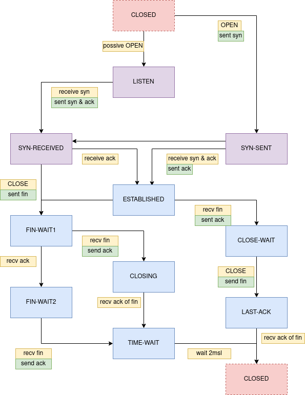

TCP（传输控制协议，Transmission Control Protocol）是一种端到端的、面向连接、可靠的传输层协议。在实现上基于ip协议，一个通过网络数据报（internet datagram）接收/发送数据的协议。在此基础上，TCP主要提供了如下的几个能力：

- 面向连接
- 基础的数据传输
- 可靠性(Reliability)
- 流量控制(FlowControl)
- 多路复用(Multiplexing)

本文主要介绍Reliability和FlowControl

## 可靠性(Reliability)

保证可靠性，需要应对网络环境中的各种不确定性，包括数据损坏、丢失、重发、乱序等等。在这种网络情况，tcp提出了如下机制来保证数据传输的可靠性。

- Sequence Number：为每个bytes都分配了一个顺序的Sequence Number，可以解决数乱序的问题。
- Acknowlidgement Number（ACK）： ACK机制是保证数据发送方确认数据被接收到的回复。
- 超时重发机制：发送的数据段，会将数据放入超时重发队列，在一段时间没有收到ack，就会重新发送。

通过以上三种机制，tcp保证了在复杂的网络环境中，提供了可靠的数据传输能力。

## 复用(Multiplexing)

为了支持多进程同时使用tcp，tcp使用ip+port组成了一个socket，由一对socket确定一个唯一的连接（包含主机ip、port以及目标机器ip、port）。接收端的TCP服务就是根据不同的端口号来将数据包传送给应用层的不同程序，这个过程叫做解复用(demultiplex)。相应的发送端会把应用层不同程序的数据映射到不同的端口号，这个过程叫做复用(multiplex)。

## 连接

TCP的整个数据传输的过程都是基于连接的，连接是TCP对上层做的一个抽象，一个连接维护了两端需要同步的一些信息，比如sockets、sequence number、window等等。而建立和销毁连接的过程则是对这些信息的初始化、同步的过程。基于此TCP提供了一组状态机来维护每个连接生命周期的状态。整个状态机分为两组，一组为未同步状态，是连接还未建立起来的一组状态集合；另一组为已同步状态，是包括创建到最后销毁过程的状态集合：

- 未同步状态
    - CLOSED：一个虚拟的状态，此时表示没有这个连接
    - LISTENED：被动的开启，等待别人进行连接
    - SYN-SENT：主动开启后，进入的状态
    - SYN-RECV：收到连接同步请求的状态
- 已同步状态
    - ESTABLISHED：连接已创建
    - FIN-WAIT1：主动发起关闭连接，等待另一端确认
    - CLOSE-WAIT：被动关闭连接，等待数据发送完成
    - FIN-WAIT2：由FIN-WAIT1收到确认后的下一个状态，等待另一端的FIN指令
    - LAST-ACK：CLOSE-WAIT发送完数据后的下一个状态，发送完关闭连接。
    - CLOSING：两端同时发起关闭，会到达CLOSING状态
    - TIME-WAIT：关闭时，防止最后的ACK对方无法收到，会在TIME-WAIT状态等待两个msl，然后关闭连接。

### 状态转移

下图包含了一个连接在整个生命周期的状态转移图示，注意这并不是状态变换的所有情况，并没有包含异常处理的状态转移。更详细的可以看[tcp详细状态](http://www.medianet.kent.edu/techreports/TR2005-07-22-tcp-EFSM.pdf)

### 初始化连接（三次握手）

初始化连接的过程，一般在两端包含三次信息交换的过程，因此被称做三次握手。三次握手的过程中，主要是为了同步两端的一些信息，识别已失效的数据，例如对方能接收的报文段长度、对方发送包分的开始序列号（seq number）。三次握手的示例见下图：

假设连接的两端分别为小c和小s。他们俩住在两个小区，通过让其他人传话的方式沟通，因此会出现很多复杂不可预测的情况。因此两人做了一个约定，每次交流开始之前两人分别随便在心里想一个数字，然后告诉对方，后面的传话，每个字都把这个数字+1,让对方知道自己发送的顺序。当两人都知道了对方的心里的数字时，就可以交流真正的信息了。让对方知道自己的数字这个同步过程，他们起了个名字：三次握手，并且把双方同步后的状态叫做已建立连接。整个过程表示如下：

- 小c想和小s说话了，于是心里想出一个数字（x），并让其他人传话：s，我要找你说话，我下次说话要用这个数字（x）开头
- 当小s收到一个（x）时，自己也想出一个数字（y），并让其他人传话：c，我知道你要说话了，并且觉得你下一句话应该是用（x+1）开头，我后面说话会用（y）开头
- 小c等了一会，等到了s的回复并知道了数字（y），于是让其他人传话：ok，小s，我觉得你后面一句话应该是用（y+1）开头

此时，当小s收到最后一次确认的时候，连接建立完成，双方到达已建立连接的状态（ESTABLISHED）。

注意，三次握手是最常用的连接情况（server被动监听、client主动连接），但并不是唯一的连接过程。双方同时主动发起连接，也可以完成一次连接，情况可以参照上面的状态机想象一下。

### 关闭连接（四次挥手）

关闭连接的过程，一般在两端包含四次信息交换的过程，因此也被称做四次挥手。四次回收的过程，是为了同步两边的状态，使双方都知道连接关闭，不再发送数据，同时释放占用的资源。四次挥手的过程示例如下图示：

根据如上小s和小c二人，当小c数据发送完成想关闭连接时，发生了一次状态同步的过程，表示如下：

- 小c想结束本次对话，于是让其他人传话：s，我想说的都说完了，就不说了吧。（FIN）
- 当s收到消息后，马上找人帮忙恢复：c，我知道了，我看看我的数据发完没，发完告诉你。（ACK）
- 当s检查数据发送完成后，又让人给c传话：c，我这边发送完了，可以结束了。（FIN）
- 小c收到s的消息后，让人传话回复：我知道了。（ACK）

此时当小s收到最后的回复后，关闭连接，清理资源。同时小c不确定是否最后的回复s可以收到，于是多等了一会（2msl）后关闭连接，清理资源。

注意，四次回收也不是唯一的关闭连接的过程，双方同时结束连接会走另外的流程。这里就不多说了，可以参考上述状态机来做一下思考。

## 流量控制(FlowControl)

在数据发送过程中由于发送端不清楚接收端的数据处理能力，导致发送端持续发送数据，接收端在数据超过自己缓存区的时候，就会丢掉数据，这样不仅导致数据传输效率差、还会大量占用网络带宽。于是TCP作为基础的传输层能力，需要提供可以让接收端控制发送端流量的方式。于是就有了我们耳熟能详的滑动窗口。滑动窗口通过在建立连接时同步的窗口扩大因子（window scale factor），以及每次ACK时的win字段（接收方回应发送方可接受缓冲大小），确定发送方可以发送的数据长度。下面是滑动窗口可能会遇到的一些问题。

### Zero Window（零窗口问题）

如果发送端一直发送数据，发送的速度超过了接收端的处理能力，那么窗口大小会一直减小，最终达到0。当窗口大小为0时，发送端就不能继续发送数据了。那么发送端要等到什么时候呢？

- 发送端发送ZWP（Zero Window Probe）包给接收端，接收端Ack其窗口大小
- 如果接收端滑动窗口不为0，则接收端主动发送TCP Window Update来更新发送方的滑动窗口

### 糊涂窗口综合征（Silly Window Syndrome）

这个是由于在滑动窗口过程中，每次只滑动一点，就会导致每次只发送少量数据，可能会导致持续大量发送小批量数据。这个问题需要同时考虑接收和发送两端：

如果是接收端引起的问题：如果接收端收到的数据导致Window size小于某个值，可以直接Ack(0)回复发送端，这样就把Window给关闭了，发送端就不会继续发送数据。当接收端处理了一些数据后Windows size 大于等于了MSS，或者接收端缓冲区有一半为空，通知发送端可以继续发送数据。

如果是发送端引起的问题，那么就会使用著名的 Nagle’s 算法。这个算法的思路也是延时处理，需要满足如下两个条件：

- 要等到 Window size>=MSS 或是 Data Size >=MSS，
- 收到之前发送数据的Ack，才会发数据，否则就是在攒数据。

Nagle算法默认是打开的，所以，对于一些需要小包场景的程序——比如像telnet或ssh这样的交互性比较强的程序，你需要关闭这个算法。

## 异常情况

整个过程中，还有一部分由于网络问题导致的异常情况，这个TCP提供了reset机制来处理各种正常设想外的情况。

### 产生reset的场景
- 没有连接时，收到数据段（除reset请求外），回复reset
- 连接未同步状态时（LISTEN、SYN-SENT、SYN-RECV），收到未发送消息的确认，回复reset
- 同步状态，收到无法接收的数据段（例如seq number不对），回复reset

### reset的处理
- 接收方状态是LISTEN时，忽略
- 接收方状态是SYN-RECEIVED，恢复到LISTEN状态
- 接收方状态时SYN-SENT时，如果reset报文包含对SYN的回应，可以接受，走正常流程
- 其他情况，关闭连接，并建议用户关闭连接。
