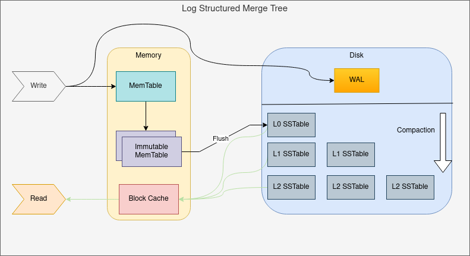
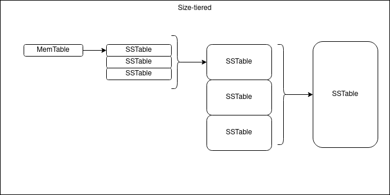
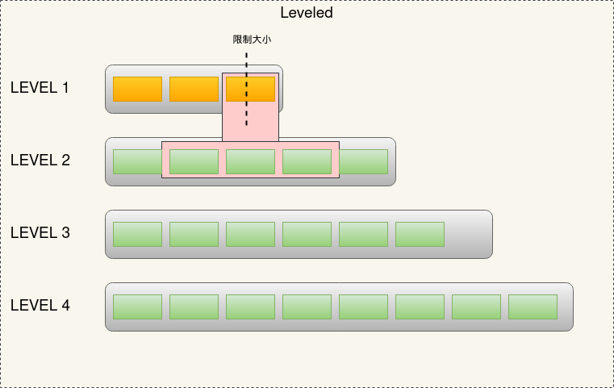

LSM-TREE(Log-structured Merge Tree)是一种利用磁盘特性，显著提升写吞吐量的存储查询结构。主要是利用了磁盘在顺序访问的效率远高于随机访问的效率，通过设计的分层存储的方式和WAL（Write-ahead logging），达到增大写吞吐量的目的。对于随机的索引，也能有很高的吞吐量。

## 和B+树的对比

首先B+树本身也很好的利用了磁盘的特性做了优化，减少磁盘IO、底层用链表可以让范围查询可以顺序访问磁盘。主要有下列一些优点：

- 高度低，block内索引密度高，可以减少io次数
- 是平衡树，且数据都位于叶子节点，查询稳定
- 叶子节点形成有序链表，范围查询时可以顺序访问磁盘，提高读取效率

不过B+树在提升查询速度和稳定性的同时，牺牲了写入时的吞吐量作为代价。在使用innodb的mysql时，会建议使用自增id作为主键，就是为了减少维护索引的B+树并且保证叶子有序的成本。如果使用随机的index，那么大量的insert操作，就会带来磁盘大量的随机写操作。即离散的index会导致写性能下降。

## 概念

- 读放大： 读取数据时实际读取的数据量大于真正的数据量。
- 写放大： 写入数据时实际写入的数据量大于真正的数据量。
- 空间放大： 数据实际占用的磁盘空间比数据的真正大小更多。

## LSM树的介绍

和B+树不同的是，在这个写入和查询的取舍中，LSM树选择了偏向写。将写入数据分层，最上层放在内存中的MemTable，所有的写入均为内存操作。同时为了保证已经写入数据的可靠性，将所有的写入记录在磁盘的WAL中，于是对任意key的写入操作，变成了对磁盘的顺序写入以及内存的表维护，并在MemTable到达足够大小的时候刷入磁盘。整个LSM由下面几个概念构成。

### MemTable

MemTable是保存在内存中的数据结构，保存了最新的数据。会按照key的顺序有序组织数据。对于这块有序组织如何实现，实现者可以根据自身的需求来自行选择。

### WAL

由于LSM树是存放在内存中的，在断电的情况，可能会导致一部分最新的数据丢失。因此这里使用了WAL来持久化到磁盘中，由于WAL中的数据只是增量日志的形式，因此无需随机读写磁盘。

### Immutable MemTable

当MemTable达到一定大小时，需要写入磁盘。这时为了不阻塞数据写入的过程，会先将MemTable转化为Immut MemTable,并新开一个MemTable用来写入新数据。然后将Immut MemTable刷入磁盘变为SSTable。

### SSTable(Sorted String Table)

是有序的键值对的集合，是LSM-TREE在磁盘中存放的结构。为了加快SSTable的读取，可以通过对文件中的key建立索引以及使用布隆过滤器来加速查询的过程。

同时在每一层达到一个预设的限制时，会通过Compact操作合并到下一层。

## Compact策略

为了防止SSTable不断的变多（其中会有大量冗余的数据），需要进行Compact来控制冗余的数据。具体的合并策略会在读放大、写放大以及空间放大这几个问题之间做取舍。在应用层面，可以根据应用的场景来选择不同的合并策略。

### 1. size-tiered Compact

size-tiered主要是限制了每一层SSTable的数量，当本层的SSTable到达指定数量后，会触发Compact操作，将其合并为一个大的SSTable并放入下一层。这样每层的SSTable大小都是相近的。

不过size-tiered会有一个问题就是空间放大会比较严重，因为每一层的key都不一定是唯一的，只有在每一层合并为下一层的一个文件时，才会消除合并前的key冗余情况。

### 2. Leveled Compact

leveled同样是分层的思路，不过在每一层中，leveled可以保证key的全局有序，因此除第一层外(第一层是直接刷如的Immut MemTable)，在每一层中key都是有序且唯一的。leveled的合并过程是当当前层的总大小超过限制后，会从该层选择至少一个文件，然后和下一层所有文件进行合并，合并的文件放入下一层。

如上述图片示例过程：
- immutable memTable刷入导致L1达到限制，触发compact
- 选择L1的至少一个文件，合并入L2。根据L1所选文件的key范围，决定合并入L2的哪些文件中。
- 当L2也达到限制时，就会触发L2的compact操作，其他层同理。多个不相干的合并是可以并发进行的。

因为每层的key不会重复，所以相比size-tiered的方式，leveled在空间放大的情况的到了缓解。不过由于每次合并可能涉及到多个文件，最坏的情况可能覆盖下层的所有SSTable，这种情况一次compact会设计到下层的所有数据。突出了写放大的问题。

## LSM树的问题

为了更大的写吞吐量设计的存储结构，也带来了相应的问题：

- 冗余存储：对于某个key，实际上只有最新的记录是有用的，但是其他的记录也会占用一定的空间。为了防止SSTable的不断膨胀，需要通过Compact来去掉无用的存储。
- 读取速度：因为SSTable是分层存储，查询需要从后往前（从最新的记录开始）遍历，最坏可能要遍历所有的数据。即使有索引或者布隆过滤器来优化，性能也会收到一定的影响。

## LSM树的应用

LSM树是有别与B+树的存储查询设计，选择了面向更大的写吞吐量的场景。实际项目的应用中，包括RocksDB、LevelDB、HBase都是基于LSM的思想来进行的存储结构的设计。因此，理解了LSM树会对理解这些基于这种设计思路的存储引擎很有帮助。也更有助于在真实工作中涉及到存储查询系统相关的抽象时，可以更好的根据需求场景来进行取舍。

## 参考

[wiki](https://en.wikipedia.org/wiki/Log-structured_merge-tree)
[LSM Compaction Strategy](https://www.jianshu.com/p/8de55d5df05e)
[LSM树详解](https://zhuanlan.zhihu.com/p/181498475)
